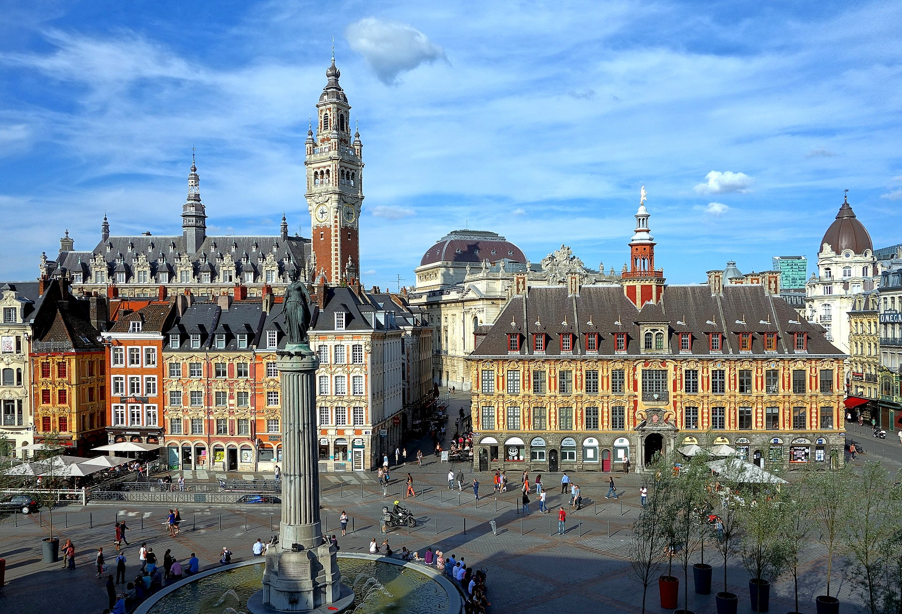

## About me

### Academic career

I am a theoretical evolutionary biologist. I obtained my PhD from the University of Lille (France) in March 2021, under the supervision of Prof. <a href="https://eep.univ-lille.fr/sylvain-billiard/"  target="_blank">Sylvain Billiard</a>. During my PhD, I used mathematical models and individual-based computer simulations to study the relationship between life-history, mating system and mutation load in flowering plants. I then joined the Department of Ecology & Evolution at the University of Lausanne (Switzerland) as a postdoc in October 2021, where I am working under the joint supervision of Prof. <a href="https://lab-mullon.github.io/index.html"  target="_blank">Charles Mullon</a> and Prof. <a href="https://www.unil.ch/fbm/en/home/menuinst/recherche/ssf/dee/recherche/groupe-pannell.html"  target="_blank">John Pannell</a>. I currently develop theory on the evolution of plant sexual systems, with a particular focus on the transition from combined to separate sexes. Starting September 2026, I will be an independent <a href="https://www.snf.ch/en/N18L3oGWomTSSGkF/funding/careers/ambizione" target="_blank">Ambizione fellow</a> at the <a href="https://www.unifr.ch/bio/en/research/eco-evol/" target="_blank">University of Fribourg</a>, where I will build new theory for life-history evolution in modular organisms.

### A more personal presentation

 I was born in 1994 in Lille (France), where I grew up and studied until I got my PhD and moved to Lausanne (Switzerland) in October 2021. My becoming an evolutionary biologist has a lot to do with my grandfather, who was a professor in plant evolutionary ecology at the University of Lille. He introduced me to the wonders of plant evolution, and in particular to the astounding diversity of ways in which plants reproduce, which I am fascinated with and extremely fortunate to still work on today. This deeply rooted passion for plant biology kindled a more general interest for all things to do with ecology and evolution, which I am always keen to think and chat about, especially with a good pint in hand. Outside of science, I enjoy cooking, hiking, drinking nice beer, playing chess and badminton with friends. I spent many years as a scout and later scout leader in the Scouts et Guides de France association, which has had a defining influence on my life and development as a human being. As a scout, I was taught to <em>do my best</em> (the cub scout motto) to work as part of a team, to be of service to others and to treat them with kindness. As a scout leader, I learnt to lead with fairness and compassion as guiding principles. I try to uphold these values in my everyday life. 

## Open PhD position!

I am looking for a PhD student to work this me for 4 years starting September 1st, 2026 at the University of Fribourg as part of my Ambizione fellowship. A more detailed job description is available [here](assets/files/PhD_UniFribourg_TheoreticalEvolutionaryBiology.pdf). Deadline for application is <b>April 24th, 2026</b>. 




